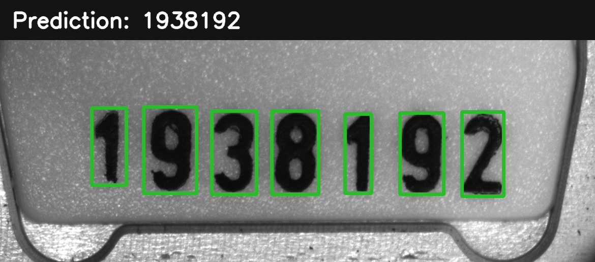

# Vision Crafters Seal OCR Submission

This folder is a self-contained inference package for reading seven-digit industrial seal codes. It uses OpenCV to locate and prepare the digits and a trained CNN to classify them.



## Requirements

- Python 3.12
- NumPy 1.26.4
- OpenCV 4.11.0
- PyTorch 2.10.0

Install the pinned packages from inside this folder:

```powershell
python -m pip install -r requirements.txt
```

## Run

From the directory containing this `submission` folder:

```powershell
python -B submission/main.py --input-dir PATH_TO_PNG_IMAGES --output-dir results --device auto
```

The command creates `results/vision_crafters.csv`:

```text
filename;number
00000.png;1938192
```

Images are sorted by filename and processed one at a time. The model is loaded once, and the seven crops from the current image are predicted together. CUDA is selected automatically when available.

Use a new output directory for each run. If localization fails, the program tries a deterministic fixed-layout CNN fallback. If an image cannot be decoded or fallback processing fails, it writes `0000000`, logs the failure, and continues so the final CSV still contains one row per PNG.

## Included files

| Path | Purpose |
| --- | --- |
| `main.py` | Competition command-line entry point |
| `common/` | Localization and digit crop preprocessing |
| `cnn/` | CNN architecture and inference code |
| `weights/best.pt` | Verified trained baseline checkpoint |
| `requirements.txt` | Runtime dependencies |

The verified local test result is 1,413 correct codes out of 1,414 (99.9293%). This does not guarantee accuracy on unseen competition images.
